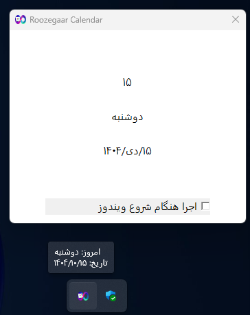
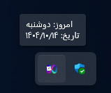
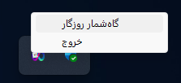

# گاه‌شمار روزگار

## اسکرین شات‌ها
|  |  |  |
|---|---|---|

## امکانات

- نمایش تاریخ شمسی با اعداد فارسی
- نمایش روز هفته به زبان فارسی
- نمایش تاریخ کامل به شکل `روز/ماه/سال` در بالون نوتیفیکیشن
- نمایش آیکون برنامه در System Tray
- منوی راست‌کلیک روی آیکون برای باز کردن پنجره اصلی یا خروج از برنامه
- بالون اطلاع‌رسانی هنگام حرکت موس روی آیکون
- استفاده از Resource برای آیکون برنامه و متن‌ها

## نحوه استفاده

1. برنامه را اجرا کنید، آیکون آن در **System Tray** ظاهر می‌شود.
2. موس را روی آیکون ببرید تا بالون حاوی تاریخ امروز نمایش داده شود.
3. راست‌کلیک روی آیکون منوی برنامه را نمایش می‌دهد:
   - **گاه‌شمار روزگار**: باز کردن پنجره اصلی برنامه
   - **خروج**: بستن برنامه

---

## زبان برنامه‌نویسی

این برنامه با **C** نوشته شده و از **Windows API** برای ایجاد پنجره‌ها، نمایش آیکون در System Tray و بالون نوتیفیکیشن استفاده می‌کند.

---

## ساخت پروژه با CMake

این پروژه با **CMake** مدیریت و ساخته می‌شود. برای ساخت برنامه مراحل زیر را دنبال کنید:

```bash
# ساخت پوشه build
mkdir build
cd build

# اجرای CMake
cmake ..

# ساخت برنامه
cmake --build .
